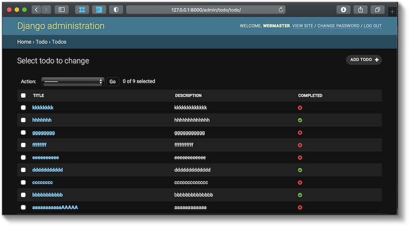

django-todo-react
=================

The tutorial about using Django and React from DigitalOcean:

`How To Build a To-Do application Using Django and React <https://www.digitalocean.com/community/tutorials/build-a-to-do-application-using-django-and-react>`_

Setup
-----

::

    cd backend
    mkvirtualenv django-todo-react --python=python3
    pip install -r requirements/base.txt

::

    cd frontend
    npm install

Usage
-----

::

    cd backend
    workon django-todo-react
    python manage.py runserver

::

    cd frontend
    npm start

Screenshots
-----------

   Backend

.. figure:: ./etc/screenshots/frontend.png

   Frontend
